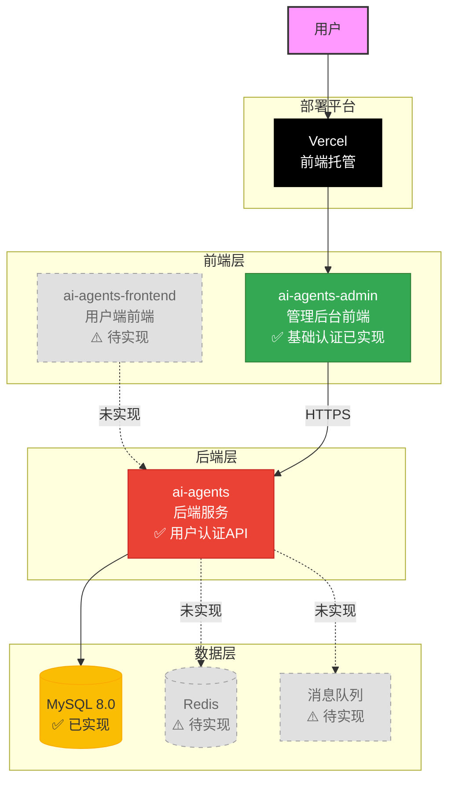
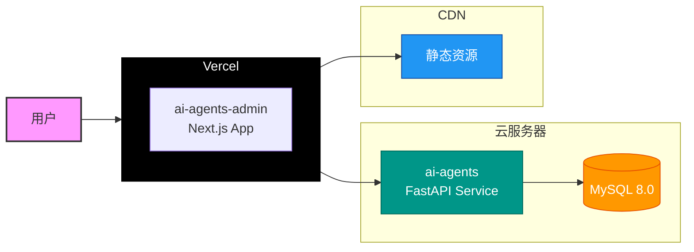

# 系统架构设计

## 系统整体架构



## 架构说明

### 1. 前端层

#### ai-agents-admin（管理后台）✅ 已实现
- **技术栈**：Next.js 14 + React 18 + TypeScript + Tailwind CSS
- **部署方式**：Vercel
- **已实现功能**：
  - 用户注册（/register）
  - 用户登录（/login）
  - 主页面板（/）
- **待实现功能** ⚠️：
  - AI 代理管理
  - 数据统计

#### ai-agents-frontend（用户端）⚠️ 待实现
- **技术栈**：待定
- **部署方式**：待定
- **主要功能**：用户交互界面

### 2. 后端层

#### ai-agents（API服务）
- **技术栈**：FastAPI + SQLAlchemy 2.0 + Pydantic
- **架构模式**：分层架构（Controller → Service → Repository）
- **认证方式**：JWT
- **已实现接口**：
  - POST `/api/v1/auth/register` - 用户注册
  - POST `/api/v1/auth/login` - 用户登录
  - GET `/api/v1/auth/me` - 获取当前用户信息
- **待实现接口** ⚠️：
  - AI 代理管理 API
  - 其他业务接口

### 3. 数据层

#### 数据库
- **类型**：MySQL 8.0
- **ORM**：SQLAlchemy 2.0
- **特性**：支持自动建表（AutoMigrate）

#### 缓存 ⚠️ 待实现
- **类型**：Redis
- **用途**：会话管理、热点数据缓存

#### 消息队列 ⚠️ 待实现
- **类型**：RabbitMQ/Kafka
- **用途**：异步任务处理、事件驱动

## 部署架构



### 部署说明

#### 前端部署（Vercel）
1. **自动部署**：通过 GitHub 集成，推送代码自动触发部署
2. **环境变量**：
   ```
   NEXT_PUBLIC_API_URL=https://api.yourdomain.com
   ```
3. **构建配置**：
   - Build Command: `npm run build`
   - Output Directory: `.next`
   - Install Command: `npm install`
4. **域名配置**：支持自定义域名绑定

#### 后端部署
1. **部署方式**：Docker 容器化部署
2. **反向代理**：Nginx
3. **进程管理**：Supervisor/PM2
4. **环境配置**：通过环境变量管理不同环境

### 环境划分

| 环境 | 前端域名 | 后端API | 数据库 |
|------|---------|---------|--------|
| 开发 | localhost:3000 | localhost:8000 | ai_agents_dev |
| 测试 | test.yourdomain.com | api-test.yourdomain.com | ai_agents_test |
| 预发布 | staging.yourdomain.com | api-staging.yourdomain.com | ai_agents_staging |
| 生产 | app.yourdomain.com | api.yourdomain.com | ai_agents |