# AI-Agents 详细设计文档

## 1. 系统架构设计

### 1.1 整体架构概述

AI-Agents 采用现代化的分层架构设计，基于 FastAPI 构建的异步 Web 服务，集成多种数据库技术和 AI 服务，形成一个功能完整的智能对话代理系统。

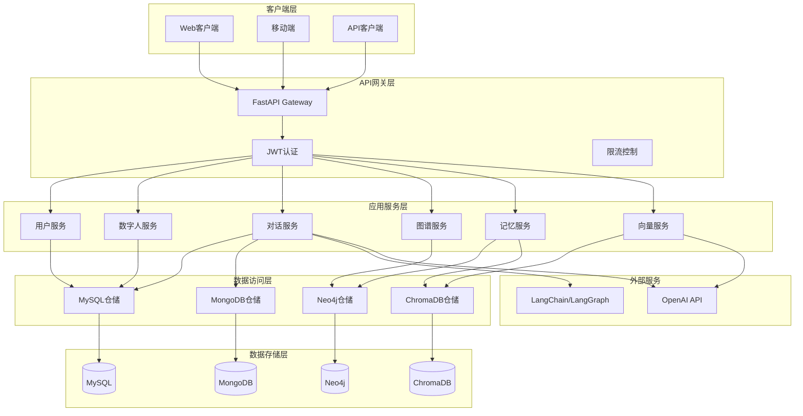

### 1.2 技术栈详细说明

#### 1.2.1 核心框架
- **FastAPI 0.111.0**: 现代化的异步 Web 框架，提供自动 API 文档生成
- **Uvicorn 0.30.1**: 高性能 ASGI 服务器
- **Pydantic 2.7.4**: 数据验证和序列化框架
- **Python 3.11+**: 运行时环境

#### 1.2.2 数据库技术
- **SQLAlchemy 2.0.30**: MySQL ORM框架
- **Alembic 1.13.1**: 数据库迁移工具
- **Neomodel 5.3.3**: Neo4j ORM框架
- **Motor 3.4.0**: MongoDB异步驱动
- **Beanie 1.25.0**: MongoDB ODM框架
- **ChromaDB 0.5.18**: 向量数据库

#### 1.2.3 AI与机器学习
- **LangChain 0.3.0**: LLM应用开发框架
- **LangGraph 0.2.0**: 对话状态图管理
- **OpenAI 1.51.2**: GPT模型接口
- **Sentence-Transformers**: 文本向量化

#### 1.2.4 认证与安全
- **PyJWT 2.8.0**: JWT Token生成与验证
- **Passlib 1.7.4**: 密码哈希处理
- **BCrypt**: 密码加密算法

#### 1.2.5 开发工具
- **Loguru 0.7.2**: 结构化日志
- **Python-dotenv 1.0.1**: 环境配置管理
- **HTTPx 0.27.0**: HTTP客户端

### 1.3 分层架构设计

```
项目结构：
app/
├── api/                    # API层
│   └── v1/
│       ├── endpoints/      # API端点
│       └── router.py       # 路由聚合
├── core/                   # 核心配置
│   ├── config.py          # 配置管理
│   ├── database.py        # 数据库连接
│   ├── logger.py          # 日志配置
│   └── memory/            # 记忆系统
├── dependencies/          # 依赖注入
│   ├── database.py        # 数据库依赖
│   ├── graph.py           # 图数据库依赖
│   └── services.py        # 服务依赖
├── models/                # 数据模型
│   ├── sqlalchemy/        # MySQL模型
│   ├── beanie/            # MongoDB模型
│   └── neomodel/          # Neo4j模型
├── repositories/          # 数据仓储层
│   ├── neomodel/          # Neo4j仓储
│   └── conversation_repository.py
├── schemas/               # 数据模式
│   ├── auth.py
│   ├── conversation.py
│   └── graph.py
├── services/              # 业务服务层
│   ├── auth_service.py
│   ├── chroma_service.py
│   ├── graph_service.py
│   └── langgraph_service.py
└── utils/                 # 工具函数
    ├── response.py        # 响应格式化
    └── request_id.py     # 请求追踪
```

## 2. 数据库设计

### 2.1 MySQL数据模型设计

#### 2.1.1 用户表 (users)
```sql
CREATE TABLE users (
    id INT PRIMARY KEY AUTO_INCREMENT,
    username VARCHAR(50) UNIQUE NOT NULL,
    email VARCHAR(100) UNIQUE NOT NULL,
    hashed_password VARCHAR(255) NOT NULL,
    full_name VARCHAR(100),
    is_active BOOLEAN DEFAULT TRUE,
    is_superuser BOOLEAN DEFAULT FALSE,
    created_at TIMESTAMP DEFAULT CURRENT_TIMESTAMP,
    updated_at TIMESTAMP DEFAULT CURRENT_TIMESTAMP ON UPDATE CURRENT_TIMESTAMP,
    INDEX idx_username (username),
    INDEX idx_email (email)
);
```
**状态**: ✅ 已实现

#### 2.1.2 数字人模板表 (digital_humans)
```sql
CREATE TABLE digital_humans (
    id INT PRIMARY KEY AUTO_INCREMENT,
    name VARCHAR(100) NOT NULL,
    description TEXT,
    personality TEXT,
    skills JSON,
    system_prompt TEXT,
    temperature FLOAT DEFAULT 0.7,
    max_tokens INT DEFAULT 2000,
    created_by INT,
    created_at TIMESTAMP DEFAULT CURRENT_TIMESTAMP,
    updated_at TIMESTAMP DEFAULT CURRENT_TIMESTAMP ON UPDATE CURRENT_TIMESTAMP,
    FOREIGN KEY (created_by) REFERENCES users(id),
    INDEX idx_name (name),
    INDEX idx_created_by (created_by)
);
```
**状态**: ✅ 已实现

#### 2.1.3 对话会话表 (conversations)
```sql
CREATE TABLE conversations (
    id VARCHAR(36) PRIMARY KEY,
    user_id INT NOT NULL,
    digital_human_id INT,
    title VARCHAR(200),
    created_at TIMESTAMP DEFAULT CURRENT_TIMESTAMP,
    updated_at TIMESTAMP DEFAULT CURRENT_TIMESTAMP ON UPDATE CURRENT_TIMESTAMP,
    FOREIGN KEY (user_id) REFERENCES users(id),
    FOREIGN KEY (digital_human_id) REFERENCES digital_humans(id),
    INDEX idx_user_id (user_id),
    INDEX idx_created_at (created_at)
);
```
**状态**: ✅ 已实现

#### 2.1.4 消息记录表 (messages)
```sql
CREATE TABLE messages (
    id INT PRIMARY KEY AUTO_INCREMENT,
    conversation_id VARCHAR(36) NOT NULL,
    role ENUM('user', 'assistant', 'system') NOT NULL,
    content TEXT NOT NULL,
    metadata JSON,
    created_at TIMESTAMP DEFAULT CURRENT_TIMESTAMP,
    FOREIGN KEY (conversation_id) REFERENCES conversations(id),
    INDEX idx_conversation_id (conversation_id),
    INDEX idx_created_at (created_at)
);
```
**状态**: ✅ 已实现

### 2.2 Neo4j图模型设计

#### 2.2.1 节点类型

**Person节点**
```python
class Person(StructuredNode):
    uid = UniqueIdProperty()
    name = StringProperty(required=True, index=True)
    age = IntegerProperty()
    email = EmailProperty(unique_index=True)
    created_at = DateTimeProperty(default_now=True)
    
    # 关系
    friends = RelationshipTo('Person', 'FRIEND_OF')
    works_at = RelationshipTo('Organization', 'WORKS_AT')
```
**状态**: ✅ 已实现

**Organization节点**
```python
class Organization(StructuredNode):
    uid = UniqueIdProperty()
    name = StringProperty(required=True, unique_index=True)
    type = StringProperty(choices=['company', 'school', 'government'])
    founded = DateProperty()
    created_at = DateTimeProperty(default_now=True)
    
    # 关系
    employees = RelationshipFrom('Person', 'WORKS_AT')
```
**状态**: ✅ 已实现

**Entity节点**
```python
class Entity(StructuredNode):
    uid = UniqueIdProperty()
    name = StringProperty(required=True, index=True)
    type = StringProperty(required=True)
    attributes = JSONProperty()
    created_at = DateTimeProperty(default_now=True)
    
    # 关系
    related_to = Relationship('Entity', 'RELATED_TO')
```
**状态**: ✅ 已实现

**Memory节点**
```python
class Memory(StructuredNode):
    uid = UniqueIdProperty()
    content = StringProperty(required=True)
    importance = FloatProperty(default=0.5)
    embedding = ArrayProperty(FloatProperty())
    timestamp = DateTimeProperty(default_now=True)
    
    # 关系
    mentions = RelationshipTo('Entity', 'MENTIONS')
    co_occurs = Relationship('Memory', 'CO_OCCURS')
```
**状态**: ✅ 已实现

#### 2.2.2 关系类型

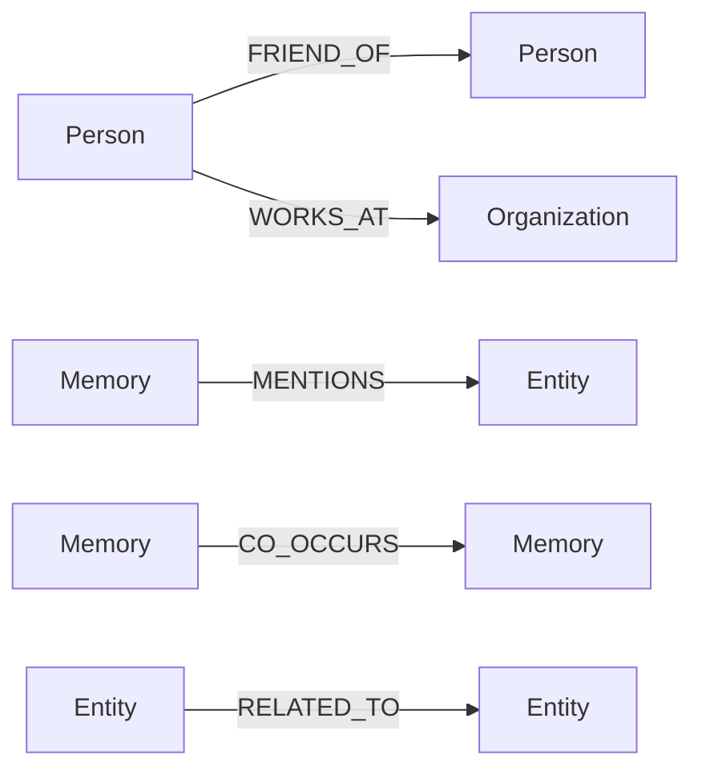

### 2.3 MongoDB文档结构

#### 2.3.1 对话历史文档
```json
{
  "_id": "ObjectId",
  "conversation_id": "uuid",
  "user_id": 1,
  "messages": [
    {
      "role": "user",
      "content": "Hello",
      "timestamp": "2024-01-01T00:00:00Z",
      "metadata": {}
    }
  ],
  "context": {
    "digital_human": "assistant_1",
    "session_data": {}
  },
  "created_at": "2024-01-01T00:00:00Z",
  "updated_at": "2024-01-01T00:00:00Z"
}
```
**状态**: ⚠️ 配置完成但未充分使用

### 2.4 ChromaDB向量存储设计

#### 2.4.1 集合结构
```python
collection_schema = {
    "name": "documents",
    "metadata": {
        "description": "文档向量存储",
        "embedding_model": "text-embedding-3-small"
    },
    "embedding_function": OpenAIEmbeddings(),
    "distance_metric": "cosine"
}
```
**状态**: ✅ 已实现

#### 2.4.2 文档存储格式
```python
{
    "ids": ["doc_1"],
    "embeddings": [[0.1, 0.2, ...]],
    "metadatas": [{
        "source": "file.pdf",
        "page": 1,
        "type": "document"
    }],
    "documents": ["文档内容文本"]
}
```
**状态**: ✅ 已实现

## 3. 核心模块设计

### 3.1 用户认证模块

#### 3.1.1 认证流程
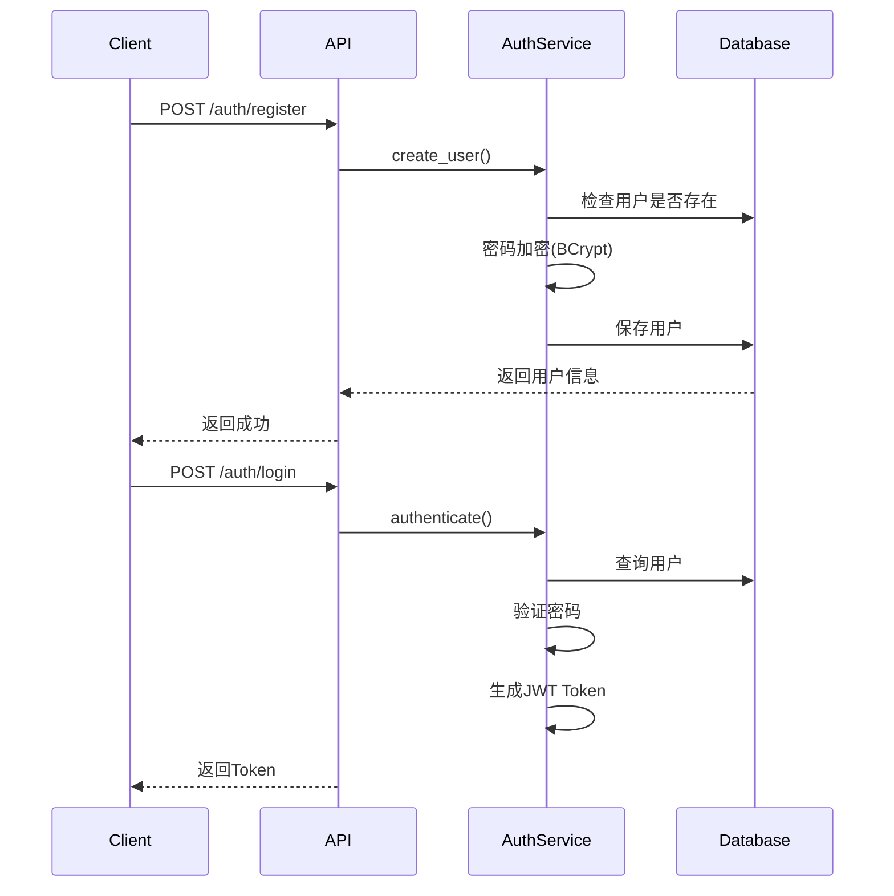

#### 3.1.2 JWT Token结构
```python
{
    "sub": "user_id",
    "username": "user_name",
    "exp": 1234567890,  # 过期时间
    "iat": 1234567800   # 签发时间
}
```
**状态**: ✅ 已实现

### 3.2 数字人模板模块

#### 3.2.1 模板配置结构
```python
class DigitalHumanTemplate:
    name: str                    # 模板名称
    description: str             # 描述
    personality: str             # 性格特征
    skills: List[str]           # 技能列表
    system_prompt: str          # 系统提示词
    temperature: float = 0.7    # 创造性参数
    max_tokens: int = 2000      # 最大输出长度
    model: str = "gpt-4o-mini" # 使用的模型
```
**状态**: ✅ 已实现

#### 3.2.2 模板管理功能
- 创建模板 (POST /digital-humans)
- 更新模板 (PUT /digital-humans/{id})
- 删除模板 (DELETE /digital-humans/{id})
- 查询模板 (GET /digital-humans)
- 模板详情 (GET /digital-humans/{id})
**状态**: ✅ 已实现

### 3.3 对话管理模块

#### 3.3.1 LangGraph状态图设计
```python
class ConversationState(TypedDict):
    messages: List[BaseMessage]
    context: Dict[str, Any]
    digital_human: DigitalHuman
    memory: List[Dict]
```

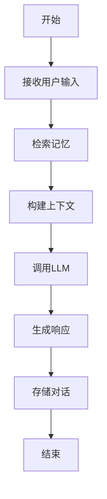
**状态**: ✅ 已实现

#### 3.3.2 流式对话实现
```python
async def stream_conversation(
    message: str,
    conversation_id: str,
    digital_human_id: int
) -> AsyncGenerator[str, None]:
    """Server-Sent Events流式响应"""
    graph = create_conversation_graph()
    config = {"configurable": {"thread_id": conversation_id}}
    
    async for event in graph.astream_events(
        {"messages": [HumanMessage(content=message)]},
        config=config,
        version="v1"
    ):
        if event["event"] == "on_chat_model_stream":
            yield f"data: {json.dumps({'content': event['data']['chunk']})}\n\n"
```
**状态**: ✅ 已实现

### 3.4 知识图谱模块

#### 3.4.1 图谱构建流程
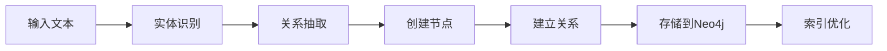

#### 3.4.2 核心功能实现

**实体管理**
```python
class EntityService:
    async def create_entity(self, name: str, entity_type: str) -> Entity:
        """创建实体节点"""
        
    async def find_entities(self, query: str) -> List[Entity]:
        """查询实体"""
        
    async def link_entities(self, entity1_id: str, entity2_id: str, 
                          relation_type: str) -> Relationship:
        """建立实体关系"""
```
**状态**: ✅ 已实现

**关系管理**
```python
class RelationshipService:
    async def create_friendship(self, person1_id: str, person2_id: str):
        """创建朋友关系"""
        
    async def create_employment(self, person_id: str, org_id: str, 
                               role: str, start_date: date):
        """创建雇佣关系"""
        
    async def find_path(self, start_id: str, end_id: str, 
                       max_depth: int = 5) -> List[Path]:
        """查找最短路径"""
```
**状态**: ✅ 已实现

#### 3.4.3 动态实体架构设计（基于 GraphRAG 理念）

**架构决策：从预定义到动态发现**

**原始问题**
预定义的实体模型（如 OrganizationNode 包含 38 个字段）存在认知锁定：
- 假设所有组织都是商业实体（revenue、valuation）
- 假设组织都有物理总部（headquarters）
- 无法适应新型组织形式（DAO、开源社区）
- 限制了知识发现的可能性

**新架构理念**
采用 GraphRAG 的核心思想：**让 AI 从数据中发现结构，而不是把数据塞进预定义结构**。

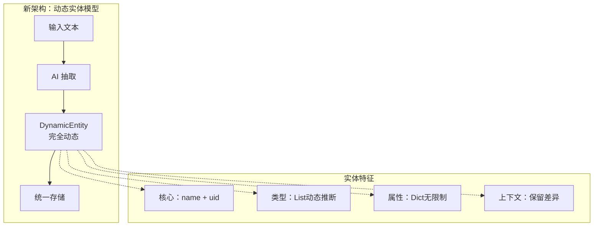

**DynamicEntity 核心设计**

```python
class DynamicEntity:
    """动态实体 - 不预设任何领域特定结构"""
    
    # 核心标识（仅这些是必需的）
    uid: str
    name: str
    
    # 动态属性
    types: List[str]  # 可以同时属于多个类型
    properties: Dict[str, Any]  # 完全动态的属性
    
    # 元信息
    contexts: List[Dict]  # 不同上下文中的表现
    sources: List[str]  # 信息来源
    confidence: float  # 置信度
    
    # 时间演化
    temporal_changes: List[Dict]  # 属性的时间变化
    
    def merge_with(self, other: 'DynamicEntity'):
        """合并另一个实体的信息，保留上下文差异"""
```

**实际案例对比**

分析"OpenAI"这个实体：

**旧方式（预定义）**：
```python
OrganizationNode(
    name="OpenAI",
    type="COMPANY",
    revenue=None,  # 不适用
    valuation=100B,
    stock_symbol=None  # 不适用
    # 大量无关字段...
)
```

**新方式（动态发现）**：
```python
# AI 可能在不同上下文中发现：
DynamicEntity(
    name="OpenAI",
    types=["研究机构", "公司", "标准制定者", "伦理倡导者"],
    properties={
        "context_1": {"focus": "AGI研究", "model": "GPT系列"},
        "context_2": {"role": "行业领导者", "impact": "改变AI格局"},
        "context_3": {"debate": "AI安全", "split": "Anthropic分裂"}
    },
    contexts=[...]  # 保留每个上下文的原始信息
)
```

**架构优势**

1. **认知解锁**：不再被预设结构限制，能发现意想不到的模式
2. **代码精简**：删除 600+ 行预定义代码，系统更简洁
3. **完全灵活**：任何实体、任何属性、任何关系都可表达
4. **上下文感知**：同一实体在不同场景可有不同表现
5. **知识发现**：让 AI 告诉我们什么是重要的，而不是我们告诉 AI

**实施效果**

- ✅ 删除 PersonNode.py (336行)
- ✅ 删除 OrganizationNode.py (337行)  
- ✅ 创建 DynamicEntity.py (约170行)
- ✅ 简化 GraphService
- ✅ 移除所有预定义验证逻辑

**核心理念**

> "The best model is no model. Let the data define the structure."
> 
> 最好的模型就是没有模型。让数据定义结构。

**状态**: ✅ 已实现

### 3.5 混合记忆系统

#### 3.5.1 记忆架构设计
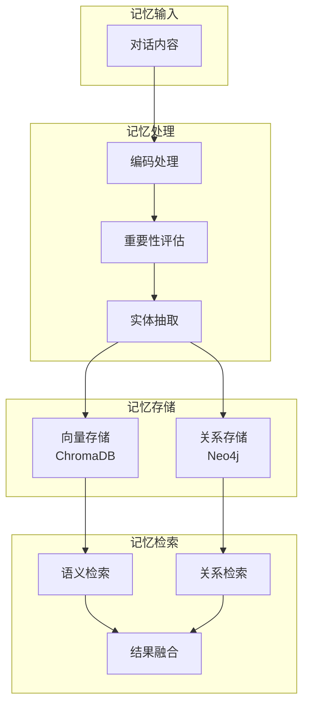

#### 3.5.2 记忆存储策略
```python
class HybridMemory:
    def __init__(self):
        self.vector_store = ChromaDB()  # 向量存储
        self.graph_store = Neo4j()      # 图存储
        
    async def store_memory(self, content: str, metadata: dict):
        # 1. 生成向量嵌入
        embedding = await self.embed(content)
        
        # 2. 存储到向量数据库
        await self.vector_store.add(
            embeddings=[embedding],
            documents=[content],
            metadatas=[metadata]
        )
        
        # 3. 抽取实体和关系
        entities = await self.extract_entities(content)
        
        # 4. 存储到图数据库
        memory_node = await self.graph_store.create_memory(content)
        for entity in entities:
            await self.graph_store.link(memory_node, entity)
```
**状态**: 🚧 基础框架已实现，高级功能开发中

### 3.6 向量搜索模块

#### 3.6.1 向量化流程
```python
class VectorService:
    def __init__(self):
        self.embedding_model = OpenAIEmbeddings(
            model="text-embedding-3-small"
        )
        self.chroma_client = chromadb.PersistentClient()
        
    async def vectorize_document(self, document: str) -> List[float]:
        """文档向量化"""
        return await self.embedding_model.aembed_documents([document])[0]
        
    async def similarity_search(self, query: str, k: int = 5):
        """相似度搜索"""
        query_embedding = await self.vectorize_document(query)
        results = self.collection.query(
            query_embeddings=[query_embedding],
            n_results=k
        )
        return results
```
**状态**: ✅ 已实现

## 4. API接口设计

### 4.1 RESTful API规范

#### 4.1.1 统一响应格式
```python
class ResponseModel(BaseModel):
    code: int = 200           # 状态码
    message: str = "成功"     # 消息
    data: Optional[Any] = None # 数据负载
    
# 成功响应示例
{
    "code": 200,
    "message": "操作成功",
    "data": {
        "id": 1,
        "name": "example"
    }
}

# 错误响应示例
{
    "code": 400,
    "message": "参数错误",
    "data": null
}
```

#### 4.1.2 HTTP状态码规范
- 200: 成功
- 201: 创建成功
- 400: 客户端错误
- 401: 未认证
- 403: 无权限
- 404: 资源不存在
- 500: 服务器错误

### 4.2 认证授权机制

#### 4.2.1 JWT认证流程
```python
# 认证装饰器
async def get_current_user(
    token: str = Depends(oauth2_scheme),
    db: Session = Depends(get_db)
) -> User:
    credentials_exception = HTTPException(
        status_code=401,
        detail="Could not validate credentials",
        headers={"WWW-Authenticate": "Bearer"},
    )
    try:
        payload = jwt.decode(token, SECRET_KEY, algorithms=[ALGORITHM])
        user_id: int = payload.get("sub")
        if user_id is None:
            raise credentials_exception
    except JWTError:
        raise credentials_exception
    
    user = db.query(User).filter(User.id == user_id).first()
    if user is None:
        raise credentials_exception
    return user
```
**状态**: ✅ 已实现

### 4.3 主要API端点

#### 4.3.1 认证相关
```
POST   /api/v1/auth/register     # 用户注册
POST   /api/v1/auth/login        # 用户登录
POST   /api/v1/auth/refresh      # 刷新Token
GET    /api/v1/auth/me           # 当前用户信息
```
**状态**: ✅ 已实现

#### 4.3.2 数字人管理
```
GET    /api/v1/digital-humans              # 获取数字人列表
POST   /api/v1/digital-humans              # 创建数字人
GET    /api/v1/digital-humans/{id}         # 获取数字人详情
PUT    /api/v1/digital-humans/{id}         # 更新数字人
DELETE /api/v1/digital-humans/{id}         # 删除数字人
```
**状态**: ✅ 已实现

#### 4.3.3 对话管理
```
POST   /api/v1/conversations                    # 创建对话
GET    /api/v1/conversations                    # 获取对话列表
GET    /api/v1/conversations/{id}               # 获取对话详情
POST   /api/v1/conversations/{id}/messages      # 发送消息
GET    /api/v1/conversations/{id}/stream        # SSE流式对话
DELETE /api/v1/conversations/{id}               # 删除对话
```
**状态**: ✅ 已实现

#### 4.3.4 图谱管理
```
POST   /api/v1/graph/entities                   # 创建实体
GET    /api/v1/graph/entities                   # 查询实体
POST   /api/v1/graph/relationships              # 创建关系
GET    /api/v1/graph/path                       # 查找路径
GET    /api/v1/graph/neighbors/{entity_id}      # 查找邻居节点
```
**状态**: ⚠️ API端点文件缺失，需要创建

#### 4.3.5 向量搜索
```
POST   /api/v1/chroma/collections               # 创建集合
GET    /api/v1/chroma/collections               # 获取集合列表
POST   /api/v1/chroma/documents                 # 添加文档
POST   /api/v1/chroma/search                    # 向量搜索
DELETE /api/v1/chroma/collections/{name}        # 删除集合
```
**状态**: ✅ 已实现

## 5. 业务流程设计

### 5.1 用户注册登录流程

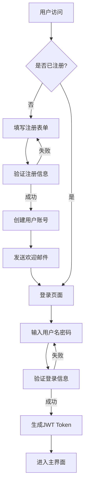

### 5.2 对话交互流程

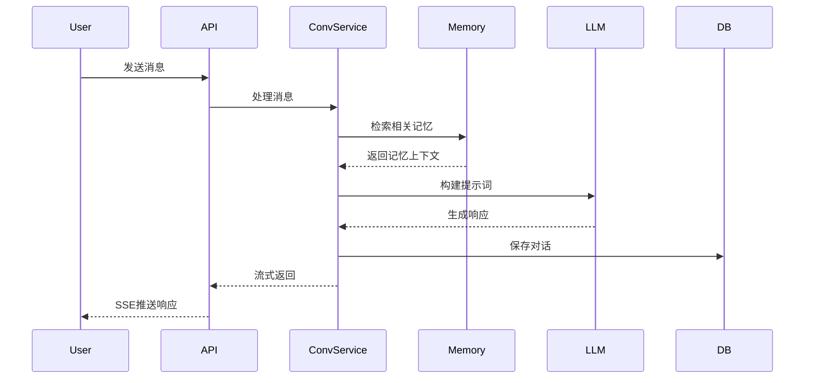

### 5.3 知识图谱构建流程

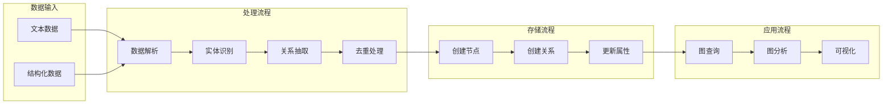

### 5.4 记忆存储和检索流程

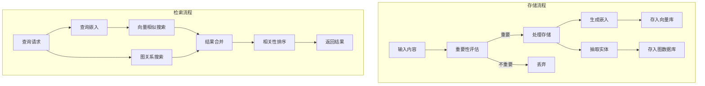

## 6. 技术实现细节

### 6.1 异步编程模式

#### 6.1.1 异步数据库操作
```python
# MySQL异步操作
from sqlalchemy.ext.asyncio import AsyncSession

async def get_user_by_id(db: AsyncSession, user_id: int):
    result = await db.execute(
        select(User).where(User.id == user_id)
    )
    return result.scalar_one_or_none()

# MongoDB异步操作
from motor.motor_asyncio import AsyncIOMotorClient

async def get_conversation(conversation_id: str):
    document = await db.conversations.find_one(
        {"_id": conversation_id}
    )
    return document

# Neo4j异步操作
from neomodel import AsyncStructuredNode

async def create_person(name: str, age: int):
    person = await Person(name=name, age=age).save()
    return person
```

#### 6.1.2 异步任务处理
```python
import asyncio
from typing import List

async def process_batch(items: List[str]):
    """批量异步处理"""
    tasks = [process_item(item) for item in items]
    results = await asyncio.gather(*tasks)
    return results
```

### 6.2 依赖注入机制

#### 6.2.1 数据库会话注入
```python
# app/dependencies/database.py
async def get_db():
    async with AsyncSessionLocal() as session:
        try:
            yield session
            await session.commit()
        except Exception:
            await session.rollback()
            raise
        finally:
            await session.close()

# 使用示例
@router.get("/users/{user_id}")
async def get_user(
    user_id: int,
    db: AsyncSession = Depends(get_db)
):
    return await get_user_by_id(db, user_id)
```

#### 6.2.2 服务注入
```python
# app/dependencies/services.py
def get_conversation_service(
    db: AsyncSession = Depends(get_db),
    graph_service: GraphService = Depends(get_graph_service)
) -> ConversationService:
    return ConversationService(db, graph_service)
```

### 6.3 配置管理方案

#### 6.3.1 环境配置
```python
# app/core/config.py
from pydantic_settings import BaseSettings

class Settings(BaseSettings):
    # 应用配置
    APP_NAME: str = "AI-Agents"
    APP_VERSION: str = "1.0.0"
    DEBUG: bool = True
    
    # 数据库配置
    MYSQL_URL: str
    MONGODB_URL: str
    NEO4J_URL: str
    CHROMA_HOST: str
    
    # JWT配置
    SECRET_KEY: str
    ALGORITHM: str = "HS256"
    ACCESS_TOKEN_EXPIRE_MINUTES: int = 30
    
    # OpenAI配置
    OPENAI_API_KEY: str
    OPENAI_MODEL: str = "gpt-4o-mini"
    
    class Config:
        env_file = ".env.dev"

settings = Settings()
```

### 6.4 日志监控体系

#### 6.4.1 结构化日志
```python
# app/core/logger.py
from loguru import logger
import sys

def setup_logger():
    logger.remove()
    logger.add(
        sys.stdout,
        format="{time:YYYY-MM-DD HH:mm:ss} | {level} | {message}",
        level="INFO"
    )
    logger.add(
        "logs/app.log",
        rotation="10 MB",
        retention="10 days",
        level="DEBUG"
    )
    return logger

# 使用示例
logger.info("User logged in", user_id=user_id, ip=request.client.host)
logger.error("Database connection failed", error=str(e))
```

#### 6.4.2 请求追踪
```python
# app/utils/request_id.py
import uuid
from contextvars import ContextVar

request_id_var: ContextVar[str] = ContextVar("request_id", default="")

@app.middleware("http")
async def add_request_id(request: Request, call_next):
    request_id = str(uuid.uuid4())
    request_id_var.set(request_id)
    response = await call_next(request)
    response.headers["X-Request-ID"] = request_id
    return response
```

## 7. 部署架构

### 7.1 Docker容器化配置

#### 7.1.1 应用Dockerfile
```dockerfile
FROM python:3.11-slim

WORKDIR /app

COPY requirements.txt .
RUN pip install --no-cache-dir -r requirements.txt

COPY . .

EXPOSE 8000

CMD ["python", "run.py", "--host", "0.0.0.0", "--port", "8000"]
```
**状态**: ⚠️ 待创建

#### 7.1.2 Docker Compose配置
```yaml
version: '3.8'

services:
  mysql:
    image: mysql:8.0
    environment:
      MYSQL_ROOT_PASSWORD: 123456
      MYSQL_DATABASE: ai_agents
    ports:
      - "3306:3306"
    volumes:
      - mysql_data:/var/lib/mysql
      
  mongodb:
    image: mongo:7.0
    environment:
      MONGO_INITDB_ROOT_USERNAME: admin
      MONGO_INITDB_ROOT_PASSWORD: password123
    ports:
      - "27018:27017"
    volumes:
      - mongo_data:/data/db
      
  neo4j:
    image: neo4j:5.15.0
    environment:
      NEO4J_AUTH: neo4j/password123
    ports:
      - "7474:7474"
      - "7687:7687"
    volumes:
      - neo4j_data:/data
      
volumes:
  mysql_data:
  mongo_data:
  neo4j_data:
```
**状态**: ✅ 已实现

### 7.2 服务启动流程

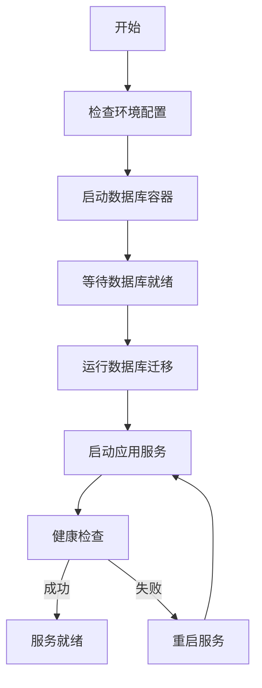

## 8. 性能优化设计

### 8.1 缓存策略

#### 8.1.1 多级缓存架构
```python
class CacheManager:
    def __init__(self):
        self.local_cache = {}  # 本地内存缓存
        self.redis_client = None  # Redis缓存 (待实现)
        
    async def get(self, key: str):
        # 1. 检查本地缓存
        if key in self.local_cache:
            return self.local_cache[key]
        
        # 2. 检查Redis缓存
        if self.redis_client:
            value = await self.redis_client.get(key)
            if value:
                self.local_cache[key] = value
                return value
        
        return None
        
    async def set(self, key: str, value: Any, ttl: int = 3600):
        # 设置本地缓存
        self.local_cache[key] = value
        
        # 设置Redis缓存
        if self.redis_client:
            await self.redis_client.setex(key, ttl, value)
```
**状态**: ⚠️ Redis集成待实现

### 8.2 并发处理

#### 8.2.1 连接池配置
```python
# MySQL连接池
engine = create_async_engine(
    MYSQL_URL,
    pool_size=20,
    max_overflow=30,
    pool_timeout=30,
    pool_recycle=3600
)

# MongoDB连接池
client = AsyncIOMotorClient(
    MONGODB_URL,
    maxPoolSize=50,
    minPoolSize=10
)

# Neo4j连接池
config.DATABASE_URL = NEO4J_URL
config.MAX_CONNECTION_POOL_SIZE = 50
```

#### 8.2.2 异步任务队列
```python
from asyncio import Queue

class TaskQueue:
    def __init__(self, max_workers: int = 10):
        self.queue = Queue()
        self.workers = []
        self.max_workers = max_workers
        
    async def add_task(self, task):
        await self.queue.put(task)
        
    async def worker(self):
        while True:
            task = await self.queue.get()
            try:
                await task()
            except Exception as e:
                logger.error(f"Task failed: {e}")
            finally:
                self.queue.task_done()
```
**状态**: ⚠️ 任务队列系统待实现

### 8.3 数据库优化

#### 8.3.1 查询优化
```python
# 使用索引
class User(Base):
    __tablename__ = "users"
    __table_args__ = (
        Index("idx_username", "username"),
        Index("idx_email", "email"),
        Index("idx_created_at", "created_at"),
    )

# 批量操作
async def bulk_insert(items: List[dict]):
    await db.execute(
        insert(Table).values(items)
    )

# 分页查询
async def get_paginated(page: int = 1, size: int = 10):
    offset = (page - 1) * size
    query = select(Model).offset(offset).limit(size)
    return await db.execute(query)
```

## 9. 安全设计

### 9.1 认证授权机制

#### 9.1.1 密码安全
```python
from passlib.context import CryptContext

pwd_context = CryptContext(schemes=["bcrypt"], deprecated="auto")

def hash_password(password: str) -> str:
    """密码哈希"""
    return pwd_context.hash(password)

def verify_password(plain_password: str, hashed_password: str) -> bool:
    """密码验证"""
    return pwd_context.verify(plain_password, hashed_password)
```

#### 9.1.2 Token安全
```python
# Token生成
def create_access_token(data: dict):
    to_encode = data.copy()
    expire = datetime.utcnow() + timedelta(minutes=ACCESS_TOKEN_EXPIRE_MINUTES)
    to_encode.update({"exp": expire})
    encoded_jwt = jwt.encode(to_encode, SECRET_KEY, algorithm=ALGORITHM)
    return encoded_jwt

# Token验证
def verify_token(token: str):
    try:
        payload = jwt.decode(token, SECRET_KEY, algorithms=[ALGORITHM])
        return payload
    except JWTError:
        raise HTTPException(status_code=401, detail="Invalid token")
```

### 9.2 数据加密策略

#### 9.2.1 敏感数据加密
```python
from cryptography.fernet import Fernet

class EncryptionService:
    def __init__(self, key: bytes):
        self.cipher = Fernet(key)
        
    def encrypt(self, data: str) -> str:
        """加密数据"""
        return self.cipher.encrypt(data.encode()).decode()
        
    def decrypt(self, encrypted_data: str) -> str:
        """解密数据"""
        return self.cipher.decrypt(encrypted_data.encode()).decode()
```
**状态**: ⚠️ 待实现

### 9.3 API安全防护

#### 9.3.1 限流控制
```python
from slowapi import Limiter
from slowapi.util import get_remote_address

limiter = Limiter(
    key_func=get_remote_address,
    default_limits=["100/minute"]
)

@app.get("/api/endpoint")
@limiter.limit("10/minute")
async def limited_endpoint():
    return {"message": "Success"}
```
**状态**: ⚠️ 待实现

#### 9.3.2 输入验证
```python
from pydantic import BaseModel, validator

class UserInput(BaseModel):
    username: str
    email: str
    password: str
    
    @validator("username")
    def validate_username(cls, v):
        if len(v) < 3 or len(v) > 20:
            raise ValueError("用户名长度必须在3-20之间")
        if not v.isalnum():
            raise ValueError("用户名只能包含字母和数字")
        return v
        
    @validator("email")
    def validate_email(cls, v):
        if "@" not in v:
            raise ValueError("无效的邮箱格式")
        return v
```

## 10. 扩展性设计

### 10.1 插件化架构

#### 10.1.1 插件接口定义
```python
from abc import ABC, abstractmethod

class PluginInterface(ABC):
    """插件基础接口"""
    
    @abstractmethod
    async def initialize(self):
        """初始化插件"""
        pass
        
    @abstractmethod
    async def execute(self, *args, **kwargs):
        """执行插件功能"""
        pass
        
    @abstractmethod
    async def cleanup(self):
        """清理资源"""
        pass

class PluginManager:
    def __init__(self):
        self.plugins = {}
        
    def register(self, name: str, plugin: PluginInterface):
        """注册插件"""
        self.plugins[name] = plugin
        
    async def execute(self, name: str, *args, **kwargs):
        """执行插件"""
        if name in self.plugins:
            return await self.plugins[name].execute(*args, **kwargs)
        raise ValueError(f"Plugin {name} not found")
```
**状态**: ⚠️ 待实现

### 10.2 服务解耦设计

#### 10.2.1 事件驱动架构
```python
from typing import Dict, List, Callable
import asyncio

class EventBus:
    def __init__(self):
        self.subscribers: Dict[str, List[Callable]] = {}
        
    def subscribe(self, event_type: str, handler: Callable):
        """订阅事件"""
        if event_type not in self.subscribers:
            self.subscribers[event_type] = []
        self.subscribers[event_type].append(handler)
        
    async def publish(self, event_type: str, data: Any):
        """发布事件"""
        if event_type in self.subscribers:
            tasks = [handler(data) for handler in self.subscribers[event_type]]
            await asyncio.gather(*tasks)

# 使用示例
event_bus = EventBus()

# 订阅事件
async def on_user_created(user_data):
    logger.info(f"New user created: {user_data}")
    
event_bus.subscribe("user.created", on_user_created)

# 发布事件
await event_bus.publish("user.created", {"id": 1, "name": "John"})
```
**状态**: ⚠️ 待实现

### 10.3 水平扩展方案

#### 10.3.1 负载均衡配置
```nginx
upstream app_servers {
    server app1:8000;
    server app2:8000;
    server app3:8000;
}

server {
    listen 80;
    
    location / {
        proxy_pass http://app_servers;
        proxy_set_header Host $host;
        proxy_set_header X-Real-IP $remote_addr;
        proxy_set_header X-Forwarded-For $proxy_add_x_forwarded_for;
    }
}
```
**状态**: ⚠️ 生产环境配置待实现

#### 10.3.2 分布式会话管理
```python
class DistributedSessionManager:
    def __init__(self, redis_client):
        self.redis = redis_client
        
    async def create_session(self, user_id: int) -> str:
        """创建分布式会话"""
        session_id = str(uuid.uuid4())
        await self.redis.setex(
            f"session:{session_id}",
            3600,
            json.dumps({"user_id": user_id})
        )
        return session_id
        
    async def get_session(self, session_id: str) -> dict:
        """获取会话信息"""
        data = await self.redis.get(f"session:{session_id}")
        return json.loads(data) if data else None
```
**状态**: ⚠️ Redis集成待实现

## 11. 项目实施状态总结

### 11.1 已完成功能 ✅

1. **基础架构**
   - FastAPI框架搭建
   - 分层架构实现
   - 多数据库集成配置

2. **核心功能**
   - JWT用户认证系统
   - 数字人模板管理
   - LangGraph对话流集成
   - Neo4j知识图谱基础功能
   - ChromaDB向量搜索
   - SSE流式对话

3. **数据层**
   - MySQL模型定义
   - Neo4j节点和关系模型
   - ChromaDB集合管理
   - 数据库迁移配置

### 11.2 开发中功能 🚧

1. **混合记忆系统**
   - 基础框架已完成
   - 高级记忆策略开发中
   - 记忆衰减和强化机制

2. **知识图谱**
   - 实体识别增强
   - 复杂关系推理
   - 图算法集成

### 11.3 待实现功能 ⚠️

1. **API层**
   - 图数据库API端点 (graph.py)
   - WebSocket实时通信
   - 文件上传处理

2. **服务层**
   - 完整的服务层抽象
   - 事件驱动架构
   - 插件系统

3. **基础设施**
   - Redis缓存集成
   - 消息队列 (RabbitMQ/Kafka)
   - 分布式任务队列
   - 监控告警系统

4. **生产环境**
   - 生产环境配置
   - Docker镜像构建
   - K8s部署配置
   - CI/CD流水线

5. **测试体系**
   - 单元测试
   - 集成测试
   - 性能测试
   - E2E测试

6. **安全增强**
   - API限流
   - 数据加密
   - SQL注入防护
   - XSS防护

## 12. 下一步开发计划

### 12.1 短期目标（1-2周）
1. 完成图数据库API端点开发
2. 实现Redis缓存层
3. 添加基础单元测试
4. 优化混合记忆系统

### 12.2 中期目标（1个月）
1. 实现完整的服务层抽象
2. 集成消息队列系统
3. 开发插件化架构
4. 完善监控告警

### 12.3 长期目标（3个月）
1. 实现分布式部署
2. 完善测试覆盖率到80%
3. 性能优化达到生产标准
4. 完成安全加固

## 13. 技术债务清单

1. **代码重构需求**
   - API端点中的业务逻辑抽取到服务层
   - 统一异常处理机制
   - 代码注释和文档完善

2. **性能优化需求**
   - 数据库查询优化
   - 添加缓存层
   - 异步任务优化

3. **安全加固需求**
   - 敏感数据加密
   - API访问控制
   - 日志脱敏处理

---

*文档版本: 1.0.0*  
*最后更新: 2024-12-31*  
*状态标记: ✅ 已实现 | 🚧 开发中 | ⚠️ 待实现*