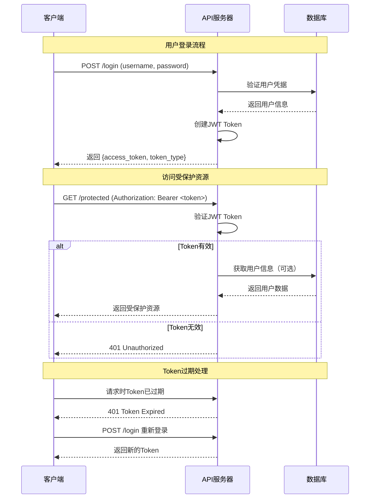

# JWT 认证

## 📚 使用说明

项目使用 JWT（JSON Web Token）进行无状态的用户认证，支持跨域和移动应用。

## 🛠 框架配置

### 安装依赖
```bash
pip install python-jose[cryptography] passlib[bcrypt]
```

### 基本配置
```python
# JWT配置
SECRET_KEY = "your-secret-key"
ALGORITHM = "HS256"
ACCESS_TOKEN_EXPIRE_MINUTES = 30

# 创建Token
def create_access_token(data: dict) -> str:
    # 设置过期时间并编码
    pass

# 验证Token
def verify_token(token: str) -> dict:
    # 解码并验证Token
    pass
```

## 🔄 认证流程时序图



## 💻 项目应用

### JWT服务
```python
# app/core/security.py
class JWTService:
    @staticmethod
    def create_access_token(data: dict) -> str:
        # 创建JWT Token，设置过期时间
        pass

    @staticmethod
    def verify_token(token: str) -> dict:
        # 验证JWT Token，返回用户信息
        pass
```

### 认证中间件
```python
# app/core/deps.py
async def get_current_user(credentials = Depends(security)):
    # 从请求头获取Token
    # 验证Token有效性
    # 返回用户信息
    pass
```

### API端点
```python
# 登录接口
@router.post("/login")
async def login(username: str, password: str):
    # 验证用户凭据
    # 生成JWT Token
    # 返回Token给客户端
    return {
        "access_token": "...",
        "token_type": "bearer"
    }

# 获取当前用户信息（实际的受保护接口）
@router.post("/current")
async def get_current_user_info(current_user = Depends(get_current_active_user)):
    # 自动验证JWT Token
    # 返回当前用户信息
    pass
```

JWT 为项目提供无状态、跨域友好的用户认证机制。