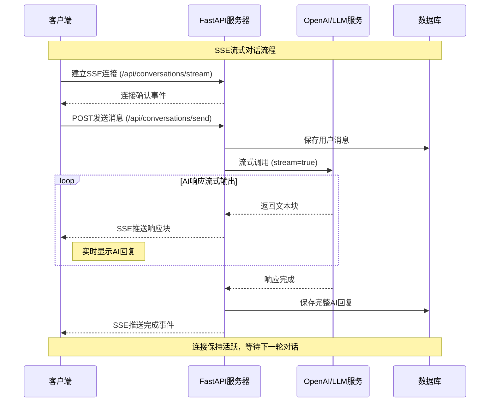

# SSE 服务器推送

## 📚 使用说明

项目使用 SSE（Server-Sent Events）实现服务器到客户端的实时数据推送，特别适用于 AI 流式响应。

## 🔄 SSE 流式对话时序图



## 💻 项目应用

### 数字人流式训练响应
```python
# app/api/v1/endpoints/digital_humans.py
from fastapi.responses import StreamingResponse
from app.services.digital_human_training_service import DigitalHumanTrainingService

@router.post("/train/stream")
async def train_digital_human_stream(
    request: DigitalHumanTrainRequest,
    current_user: User = Depends(get_current_active_user),
    training_service: DigitalHumanTrainingService = Depends(get_training_service)
):
    async def training_stream():
        try:
            yield {
                "event": "training_start",
                "data": json.dumps({
                    "digital_human_id": request.digital_human_id,
                    "message": "训练开始"
                })
            }

            async for chunk in training_service.process_training_conversation(
                request.digital_human_id,
                request.message,
                current_user.id
            ):
                yield {
                    "event": "training_chunk",
                    "data": chunk
                }

            yield {
                "event": "training_complete",
                "data": json.dumps({"message": "训练完成"})
            }

        except Exception as e:
            yield {
                "event": "training_error",
                "data": json.dumps({"error": str(e)})
            }

    return StreamingResponse(training_stream(), media_type="text/event-stream")
```

### 实时对话流式响应
```python
# app/services/conversation_service.py
from app.services.llm_service import LLMService

class ConversationStreamService:
    def __init__(self):
        self.llm_service = LLMService()

    async def stream_conversation_response(
        self,
        thread_id: str,
        user_message: str,
        digital_human_id: int,
        user_id: int
    ):
        try:
            conversation = await self.get_conversation(thread_id)
            messages = self.build_message_history(conversation, user_message)

            yield {
                "type": "user_message",
                "content": user_message
            }

            yield {
                "type": "ai_response_start",
                "digital_human_id": digital_human_id
            }

            accumulated_response = ""

            async for chunk in self.llm_service.stream_chat_completion(messages):
                if chunk.get("content"):
                    accumulated_response += chunk["content"]

                    yield {
                        "type": "ai_response_chunk",
                        "content": chunk["content"],
                        "accumulated_content": accumulated_response
                    }

            await self.save_conversation_turn(
                thread_id, user_message, accumulated_response
            )

            yield {
                "type": "ai_response_complete",
                "final_content": accumulated_response
            }

        except Exception as e:
            yield {
                "type": "conversation_error",
                "error": str(e)
            }
```

### 前端SSE集成
```javascript
// static/js/sse-client.js
class AIAgentsSSE {
    constructor(baseUrl = '') {
        this.baseUrl = baseUrl;
        this.connections = new Map();
    }

    connectToTrainingStream(digitalHumanId, onMessage, onError, onComplete) {
        const url = `${this.baseUrl}/api/v1/digital-humans/train/stream`;
        const eventSource = new EventSource(url);

        eventSource.addEventListener('training_start', (event) => {
            const data = JSON.parse(event.data);
            onMessage({ type: 'training_start', ...data });
        });

        eventSource.addEventListener('training_chunk', (event) => {
            onMessage({ type: 'training_chunk', data: event.data });
        });

        eventSource.addEventListener('training_complete', (event) => {
            const data = JSON.parse(event.data);
            onComplete(data);
            eventSource.close();
        });

        eventSource.addEventListener('training_error', (event) => {
            const error = JSON.parse(event.data);
            onError(error);
            eventSource.close();
        });

        this.connections.set(`training_${digitalHumanId}`, eventSource);
        return eventSource;
    }

    connectToConversationStream(threadId, onMessage, onError) {
        const url = `${this.baseUrl}/api/v1/conversations/${threadId}/stream`;
        const eventSource = new EventSource(url);

        eventSource.addEventListener('ai_response_chunk', (event) => {
            const data = JSON.parse(event.data);
            this.updateAIResponse(data.content, data.accumulated_content);
        });

        eventSource.addEventListener('ai_response_complete', (event) => {
            const data = JSON.parse(event.data);
            this.completeAIResponse(data.final_content);
        });

        eventSource.onerror = (error) => {
            console.error('SSE连接错误:', error);
            onError && onError(error);
        };

        this.connections.set(`conversation_${threadId}`, eventSource);
        return eventSource;
    }

    disconnect(connectionId) {
        const eventSource = this.connections.get(connectionId);
        if (eventSource) {
            eventSource.close();
            this.connections.delete(connectionId);
        }
    }

    disconnectAll() {
        for (const [id, eventSource] of this.connections) {
            eventSource.close();
        }
        this.connections.clear();
    }

    updateAIResponse(chunk, accumulated) {
        const messageDiv = document.getElementById('current-ai-response');
        if (messageDiv) {
            messageDiv.textContent = accumulated;
        }
    }

    completeAIResponse(finalContent) {
        const messageDiv = document.getElementById('current-ai-response');
        if (messageDiv) {
            messageDiv.id = '';
            messageDiv.textContent = finalContent;
        }
    }
}

// 使用示例
const sseClient = new AIAgentsSSE();

function startTraining(digitalHumanId, message) {
    sseClient.connectToTrainingStream(
        digitalHumanId,
        (data) => console.log('训练进度:', data),
        (error) => console.error('训练错误:', error),
        (data) => console.log('训练完成:', data)
    );
}

function startConversation(threadId) {
    sseClient.connectToConversationStream(
        threadId,
        (data) => console.log('对话消息:', data),
        (error) => console.error('对话错误:', error)
    );
}
```

SSE 为项目提供了高效的实时推送能力，是实现流畅AI交互体验的关键技术。